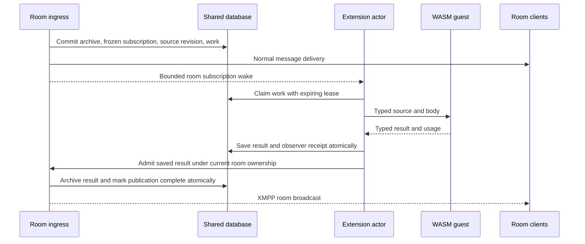

# Durable room observations

Room extensions observe accepted messages asynchronously and return declarative
XMPP payloads. Jev is the first consumer: its WASM guest makes the existing
OpenRouter decisions request and returns safety scores. Message delivery does
not wait for inference.

## Ownership and scheduling

Each configured installation has an actor on each server process. Room actors
hold typed subscription mailboxes. A full mailbox loses only a wake hint; a
one-second durable sweep discovers pending work and saved publications.

Only a local room owner processes work. The registry can restore an existing
durable room after restart using its fenced lifecycle and ownership claim.
It cannot manufacture a missing or deleted room, or steal a live foreign claim.
Without durable room registry storage, a missing actor resumes when opened.

Admission rotates between rooms, allows at most four simultaneous calls in one
room, honors the configured installation limit (eight for Jev), and caps all
observations in a process at 32. These are per-process bounds; the provider does
not receive a cluster-wide quota guarantee. Each source job has a separate
fenced lease. Recovery is independent of the lifetime of ingress envelope rows.

## Durable outcomes

The source archive and observation work commit together. Each job freezes the
installation generation, configuration identity, room, real sender, original
origin-id, original room stanza-id, current revision stanza-id, body digest, and
body. Corrections use the archive target already authorized by the room's
XEP-0308 validation. Retractions and later revisions invalidate stale work and
results.

A successful invocation saves its result and the original ingress observer
receipt in one transaction. Publishing that saved result uses a separate durable
record and never invokes the provider again. The host checks the current source
revision, active configuration, and exact saved payload inside the transaction
that archives the result. Its stable publication UUID supplies the outgoing
message identity for idempotent retries.

The frozen observer contract uses storage kind 28. Older server binaries reject
that kind instead of executing it as the retired observer hook. Its work and
publication rows have no foreign key to ingress envelopes. This is a breaking
WIT 2 cutover; any custom preexisting observer obligations must be drained before
upgrade. The formerly bundled extensions did not create those obligations.

Inference is at least once: a process can fail after the provider accepted a
request but before saving its response. A lease expiry may then repeat that
request. Temporary failures use bounded backoff and a finite attempt budget;
permanent failures and stale work receive terminal receipts. Completed or
invalidated work no longer needs its body snapshot.

### Reply text

The archived message and its source body digest retain the complete accepted
body. The observation work item contains the author's text after removing one
valid XEP-0461 reply fallback range. XEP-0428 offsets are counted as Unicode code
points under XEP-0426, before normalization or other text processing.

Extraction requires a reply marker understood by the current clients, including
a parseable reply-author JID, and exactly one reply-scoped fallback with one
explicit, bounded body range. Malformed, out-of-bounds, whole-body,
childless, duplicate, and multiple-range indications keep the complete body for
classification, matching the limits of the current clients' reply rendering.
Unknown fallback namespaces and unmarked quoted text also remain in the input.

An explicit range that leaves no authored text produces an empty-body receipt
without invoking the extension. Corrections still advance the source revision
and invalidate older work and results, including when their authored text is
empty. The source digest continues to bind results to the original accepted
body, rather than the extracted observation text.

## XMPP contract

Results use XEP-0422 `<apply-to id="original-origin-id">`. The custom
`urn:waddle:safety-scores:1` payload adds the original room stanza-id, its room
`by`, and the source revision stanza-id. The host supplies all three target
attributes; the guest cannot redirect a result.

Web, Apple, and Android match the origin and room stanza IDs on the same source
message and require the current body revision. Corrections and retractions clear
older displayed scores. Clients park results that arrive ahead of their source
or correction within their existing bounded mutation queues.

Observation invocations cannot send messages or mutate host state through host
tools. They can return one declared room result. Provider HTTP requires explicit
capability and origin grants and is bounded by deadlines, bytes, and request
count. Jev has a four-second HTTP deadline, a ten-second invocation deadline,
one HTTP request, and a 64 KiB response limit. No provider or message content is
included in observation completion logs.

## Configuration and operations

See the [chart's observation configuration](../../server/charts/waddle-server/README.md#room-observation-actors)
for generation changes, explicit revocation, resource bounds, and cutover from
the former core judgment worker. Retained old worker rows are not automatically
replayed as new extension work.

Latency histograms distinguish queue delay, invocation duration, and time until
durable publication. The observer completion log includes a fixed outcome
category, attempt number, duration, plugin ID, and whether persistence accepted
the result. Production latency must be measured after deployment; local tests
establish the scheduling and persistence contracts, not provider response time.
